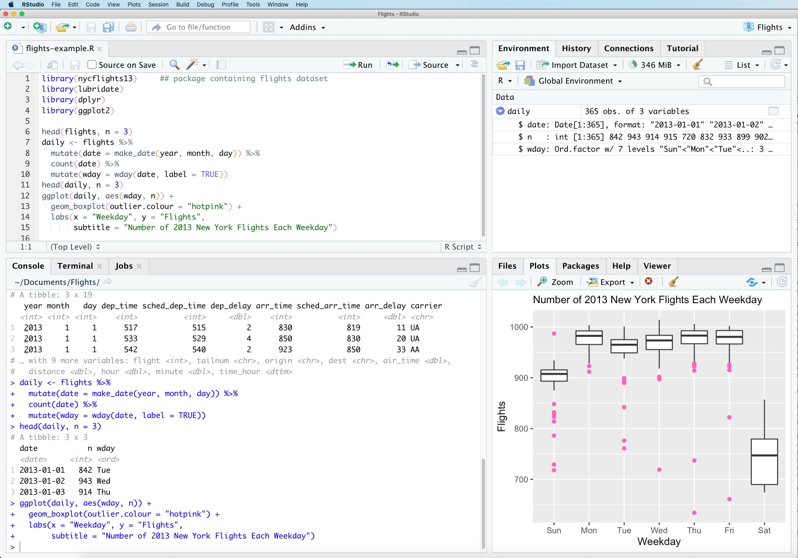

# r4immunologists

## RStudio

To install RStudio, click [here](https://posit.co/download/rstudio-desktop/).

When you open RStudio, you will see a screen like this:



As you can see, there are four panes:

1.  The top left pane is the Source Editor. This is where you write your R code.
2.  The top right pane is the Environment, which displays all user-defined objects.
3.  The bottom right pane is Plots, which is where plots are drawn.
4.  The bottom left pane is the Console. This is where you run your R code.

## Install r4immunologists

Before starting the tutorial, run the following code from the Console in RStudio to install the required packages:

```
if (!require("devtools")) install.packages("devtools")
devtools::install_github("aaron-breathnach/r4immunologists")
```

We can run the tutorial as follows:

```{r}
learnr::run_tutorial("r_for_immunologists", package = "r4immunologists")
```