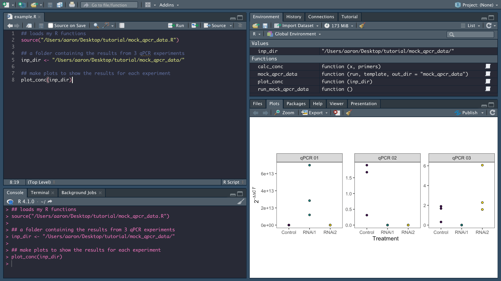
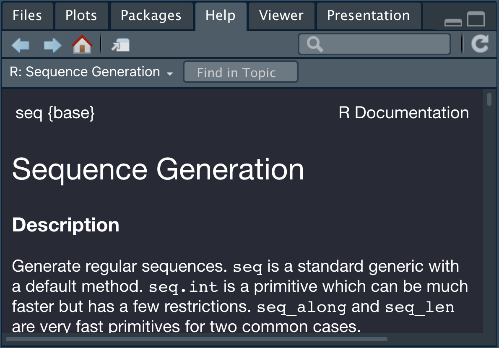
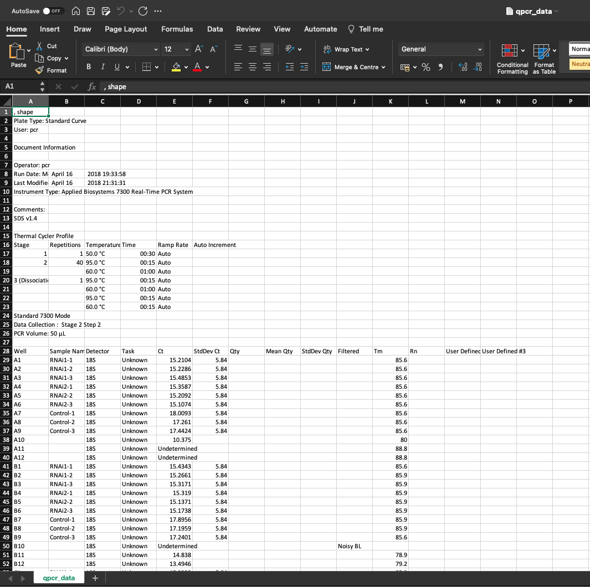
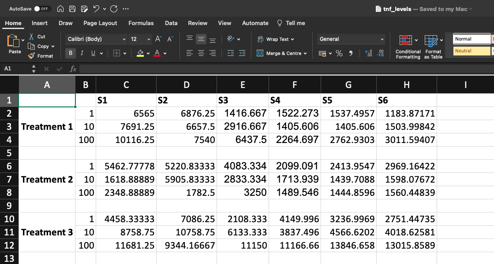
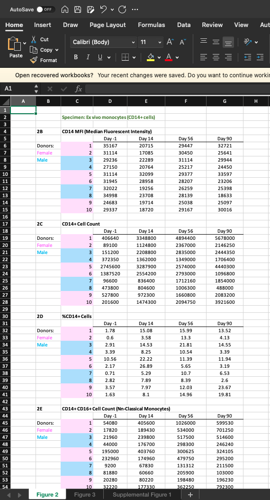
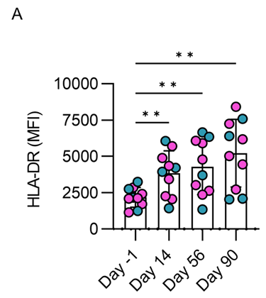
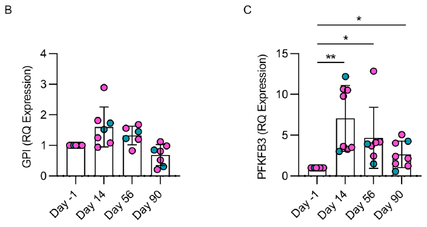
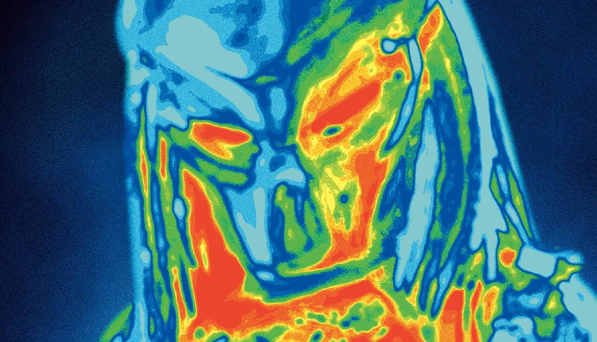

```{r setup, include=FALSE}
knitr::opts_chunk$set(echo = TRUE)

library(learnr)
library(cowplot)

cube_root <- function(x) {
  x ^ (1/3)
}

nth_root <- function(x, n) {
  x ^ (1/n)
}

dat <- readr::read_tsv("data/murphy.tsv")

dat_fig_3c <- dat |>
    dplyr::filter(panel == "Figure 3C") |>
    dplyr::select(sex, contains("Day")) |>
    tidyr::pivot_longer(cols = !sex,
                        names_to = "day",
                        values_to = "value")

pal <- c("M" = "#1199b2", "F" = "#f74ed6")

make_bar_plot <- function(dat, fig, ylab) {
  
  pal <- c("M" = "#1199b2", "F" = "#f74ed6")
  
  options(dplyr.summarise.inform = FALSE)
  
  filtered <- dat |>
    dplyr::filter(grepl(fig, panel)) |>
    dplyr::select(sex, immune_marker, contains("Day")) |>
    tidyr::pivot_longer(
      cols = !c(sex, immune_marker),
      names_to = "day",
      values_to = "value"
    ) %>%
    tidyr::drop_na()
  
  ## calculate mean and standard deviation
  mean_sd <- filtered |>
    dplyr::group_by(day, immune_marker) |>
    dplyr::summarise(
      mean = mean(value),
      sd = sd(value)
    )
  
  ggplot2::ggplot(mean_sd, ggplot2::aes(x = day, y = mean)) +
    ## plot bars
    ggplot2::geom_bar(
      stat = "identity",
      colour = "black",
      fill = NA,
      width = 0.5
    ) +
    ## plot points
    ggplot2::geom_jitter(
      data = filtered,
      ggplot2::aes(x = day, y = value, fill = sex),
      pch = 21,
      colour = "black",
      width = 0.2,
      size = 3
    ) +
    ## add error bars
    ggplot2::geom_errorbar(
      ggplot2::aes(ymin = mean - sd, ymax = mean + sd),
      width = 0.25
    ) +
    ## specify the axis labels
    ggplot2::labs(x = "", y = ylab) +
    ## adjust the y-axis
    ggplot2::scale_y_continuous(
      expand = ggplot2::expansion(mult = c(0, 0.1)),
      labels = scales::comma
    ) +
    ## set the colour palette
    ggplot2::scale_fill_manual(values = pal, guide = "none") +
    ggplot2::theme_classic(base_size = 17.5) +
    ggplot2::theme(
      axis.title.y = ggtext::element_markdown(face = "bold"),
      axis.text.x = element_text(angle = 45, hjust = 1)
    )
  
}
```

## What is R?

R is "a programming language for statistical computing and graphics".

R is used across a range of disciplines for cleaning, analysing, and visualising data.

R is popular among biologists, especially, for a number of reasons:

-   R is free

-   R is easy to use

-   There is lots of support on-line for R users

-   Many tools used in bioinformatics have been written in R

It is important to note that R is a language. Like any language, R takes time to learn. We can't expect to become fluent in French after one day. Similarly, you can't expect to become fluent in R after one tutorial. The purpose of this tutorial is to introduce immunologists to the basics of R. We will examine several examples that highlight the ways in which we could employ R in our research. The topics covered will include:

-   Reading data

-   Cleaning data

-   Visualising data

-   Running statistics

The tutorial will show researchers how to analyse a dataset from start to finish in R by guiding them through the steps listed above. The tutorial should give researchers a foundation in R, which they can build on going forward.

## Source material

I have based this tutorial on several free on-line resources, including:

-   [*Hands-On Programming with R*](https://rstudio-education.github.io/hopr/) by Garrett Grolemund.

-   [*R for Data Science*](https://r4ds.had.co.nz/) by Hadley Wickham and Garrett Grolemund.

-   [*R Cookbook*](https://rc2e.com/) by J.D. Long and Paul Teetor.

-   [*Fundamentals of Data Visualization*](https://clauswilke.com/dataviz/) by Claus Wilke.

-   [*Introduction to R for Biologists*](https://melbournebioinformatics.github.io/r-intro-biologists/intro_r_biologists.html) by Maria Doyle, Jessica Chung, and Vicky Perreau.

-   [*R Crash Course for Biologists*](https://colauttilab.github.io/RCrashCourse/1_fundamentals.html) by Rob Colautti.

## Using RStudio

R is a language, whereas RStudio "[gives you a way to talk to your computer](https://rstudio-education.github.io/hopr/basics.html#:~:text=RStudio%20gives%20you%20a%20way%20to%20talk%20to%20your%20computer)" using R. Generally, RStudio is the recommended integrated development environment (IDE) for working in R (see [*Hands-On Programming with R*](https://rc2e.com/gettingstarted#intro-GettingStarted:~:text=We%20are%20of%20the%20opinion%20that%20most%20all%20R%20work%20should%20be%20done%20in%20the%20RStudio%20Desktop%20IDE%20unless%20there%20is%20a%20compelling%20reason%20to%20do%20otherwise)). It can be installed from [here](https://www.rstudio.com/products/rstudio/download/#download).

When you open RStudio, you will see a screen like this:

{width=75%}

As you can see, there are four panes:

1.  The top left pane is the Source Editor. This is where you write your R code.
2.  The top right pane is the Environment, which displays all user-defined objects.
3.  The bottom right pane is Plots, which is where plots are drawn.
4.  The bottom left pane is the Console. This is where you run your R code.

In the Console, we can type commands directly at the prompt. For example:

```{r}
1 + 1
```

Alternatively, we can run our code from the Source Editor by pressing `Cmd` + `Enter` (MacOS) / `Ctrl` + `Enter` (Windows). The advantage of running our code from the Source Editor is that we can save it in a script, which will allow us to reproduce any analysis.

If we place `#` in front of a command, R will ignore the command and it won't produce any results:

```{r}
## 1 + 1
```

This is useful for adding annotations to our code to help make it more readable. For example:

```{r, eval=FALSE}
## addition
10 + 2
## subtraction
10 - 2
## multiplication
10 * 2
## division
10 / 2
## exponents
10 ^ 2
```

## Objects

We can store data in R as objects. To do this, we use the operator `<-`. For example:

```{r}
x <- 1
x
```

Here, the object `x` stores a value of `1`. R remembers what data is stored in an object, so the object can be used again later, for example:

```{r}
x + 1
```

We can give an object any name we like, with two exceptions:

1.  The name cannot start with a number.
2.  The name cannot contain special characters.

We can overwrite an object by assigning another value to it, for example:

```{r}
x <- 2
x
```

R is case sensitive, so in the example below, creating the object `X` does not overwrite the pre-existing object `x`:

```{r}
x <- 1
X <- 2
x == 2
```

When you create an object in R, it will appear in the Environment pane.

**Exercise**: What happens when you run the code below?

```{r x_equals_y, exercise=TRUE}
x <- 6
y <- 6
x == y
```

## Data structures

Data structures are ways of storing data. In this tutorial, we will use the following data structures: vectors, lists, and data frames. I will provide an overview of these data structures below, but for more detailed descriptions, see [Advanced R by Hadley Wickham](http://adv-r.had.co.nz/Data-structures.html).

### Vectors

Vectors are lists of objects of the same type. Vectors are created using `c()`. For example:

```{r}
my_vector <- c("a", "b", "c")
print(my_vector)
```

Generally, a vector will be one of the following classes:

-   A double vector, which stores numbers.
-   An integer vector, which stores integers.
-   A character vector, which stores a string of text.
-   A logical vector, which stores `TRUE` / `FALSE`.

We can check the class of a vector as follows:

```{r}
class(my_vector)
```

Below are examples of each class of vector:

```{r}
## double
c(1.5, 2, 0.67)
## integer
c(1, 2, 3)
## character
c("Mike D", "MCA", "Ad-Rock")
## logical
c(TRUE, FALSE, TRUE)
```

### Lists

Lists contain objects of different types. For example:

```{r}
my_list <- list(c("a", "b", "c"), c(1, 2, 3), c(4, 5, 6))
print(my_list)
```

The objects in a list can be named. For example:

```{r}
my_list <- list(id = c("a", "b", "c"), var_1 = c(1, 2, 3), var_2 = c(4, 5, 6))
print(my_list)
```

### Data frames

Data frames display lists as tables. We can create a data frame as follows:

```{r}
my_df <- data.frame(id = c("a", "b", "c"),
                var_1 = c(1, 2, 3),
                var_2 = c(4, 5, 6))
print(my_df)
```

Most of us will be familiar with working with tables, so it helps to think of data frames as tables.

## Functions

A function is an R object that performs a task by running a block of code. A function has three parts: a name, a set of arguments, and a body of code. Below, I have created a function named `cube_root` to find the cube root of the number provided by the argument `x`. Note that the body of code is placed inside the braces `{}`.

```{r}
cube_root <- function(x) {
  x ^ (1/3)
}
```

```{r}
cube_root(x = 27)
```

**Exercise**: Use the `cube_root()` function to find the cube root of 1728.

```{r cube_root, exercise=TRUE}
cube_root(x = 1728)
```

Functions can contain multiple arguments. For example, here's a function to find the *n*<sup>th</sup> root of any number.

```{r}
nth_root <- function(x, n) {
  x ^ (1/n)
}
```

**Exercise**: Use the `nth_root()` function to get the 4<sup>th</sup> root of 1296:

```{r nth_root_q, exercise=TRUE}
nth_root(x = 1296, n = 4)
```

### Help

R comes with many useful built-in functions, and it's not necessary to know what all of them do to be able to use R. If you're not sure how to use a function, you can get help by placing a `?` in front of the function's name. For example, to get help on the built-in function `seq()`, run the following command:

```{r}
?seq
```

This will open a help page in the Figure pane, like so:

{width=67%}

## Loops

The function `lapply()` allows us to run a function on a list of objects, which is useful if we need to repeat a task many times. For example, we can get the cube root for each number in a list as follows:

```{r}
values <- c(8, 27, 64)
lapply(values, cube_root)
```

**Exercise**: Write a loop to find the cube root of the following values: 62, 92, and 37.

```{r loop_eg, exercise=TRUE}

```

```{r loop_eg-solution}
## create a vector of the values
values <- c(62, 92, 37)
## loop over the vector
lapply(values, cube_root)
```

## `if...else` statments

`if...else` statements are used to run a chunk of code if a condition is met.

The following function will tell us if the temperature of a bowl of porridge satisfies Goldilocks' criteria:

```{r}
goldilocks <- function(temp) {
  if (temp < 60) {
    verdict <- "Too cold."
  } else if (temp >= 60 & temp <= 75) {
    verdict <- "Just right."
  } else if (temp > 75 & temp < 90) {
    verdict <- "Too hot."
  } else {
    verdict <- "Are you trying to burn the mouth off me?"
  }
  return(verdict)
}
```

Below, we'll check if the temperatures of four bowls of porridge pass the test:

```{r}
temperatures <- c(40, 60, 80, 100)
lapply(temperatures, goldilocks)
```

### `ifelse()`

`ifelse()` is a vectorised version of the `if...else` statement. It is used as follows:

```{r}
x <- 2
## tests if x > 1
ifelse(x > 1, "Yes", "No")

y <- 0
## tests if y > 1
ifelse(y > 1, "Yes", "No")
```

## Packages

One of the strengths of R is that there are thousands of packages available to download which come with their own functions. R packages are ["preassembled collections of functions and objects"](https://rstudio-education.github.io/hopr/packages.html).

### CRAN

Most R packages are installed from the [CRAN](https://cran.r-project.org/) repository using the built-in function `install.packages()`. For example, to install the wesanderson package, run:

```{r eval=FALSE}
install.packages("wesanderson")
```

wesanderson generates colour palettes based on Wes Anderson films. It's essential that you install this package if you want your plots to be quirky enough for publication.

To load an installed package, use the `library()` function, for example:

```{r}
library(wesanderson)
```

Once your package is loaded, you can use its functions, for example:

```{r}
## display the Royal1 palette from wesanderson
wes_palette("Royal1")
```

We can also access a function directly without loading a package. To do this, we write the package name followed by the operator `::` before the function name, for example:

```{r}
## unloads the wesanderson package
if (any(grepl("package:wesanderson", search()))) {
  detach("package:wesanderson", unload = TRUE)
}
## runs the function without loading the package
wesanderson::wes_palette("Royal1")
```

### Bioconductor

Many R packages developed for bioinformatics are installed from the [Bioconductor](https://www.bioconductor.org/) repository. Bioconductor packages are installed using the `install()` function from the BiocManager package. For example, to install DESeq2 from Bioconductor, run:

```{r eval=FALSE}
## installs BiocManager if it's not installed already
if (!require("BiocManager", quietly = TRUE))
    install.packages("BiocManager")

## installs DESeq2 from Bioconductor
BiocManager::install("DESeq2")
```

Note that I won't be discussing Bioconductor packages today. I will run a separate bioinformatics workshop at a later date.

## Enter the tidyverse

According to [tidyverse.org](https://www.tidyverse.org/):

> The tidyverse is an opinionated collection of R packages designed for data science. All packages share an underlying design philosophy, grammar, and data structures.

The tidyverse can be considered as a dialect of R, with an emphasis on readability. The authors of the tidyverse state that its ["primary goal is to facilitate a conversation between a human and a computer about data"](https://tidyverse.tidyverse.org/articles/paper.html#summary). In other words, they ["want to make it as easy as possible for first-time and end-user programmers to learn the tidyverse"](https://tidyverse.tidyverse.org/articles/paper.html#design-principles).

The core tidyverse packages are ggplot2, dplyr, tidyr, readr, purrr, tibble, stringr, and forcats.

{width=50%}

To install the tidyverse packages, run the following command:

```{r eval=FALSE}
install.packages("tidyverse")
```

Once installed, the packages are loaded by running the following command:

```{r}
library(tidyverse)
```

### Tibbles

Within the tidyverse, the tibble package provides us with the ability to use tibbles, which are data frames with ["more user-friendly printing, subsetting, and factor handling"](https://www.oreilly.com/library/view/efficient-data-processing/9781491980736/ch01.html). Tibbles makes it easier to work with large data.

**Exercise**: Run the code below to see the differences between a data frame and a tibble:

```{r tbl_df_eg, exercise=TRUE}
## load the in-built iris data frame
data("iris")

## print the data frame
print(iris)

## convert the data frame to a tibble
iris_tbl_df <- as_tibble(iris)

## print the tibble
print(iris_tbl_df)
```

As you can see, the tibble is easier to read.

Note that I will refer to tibbles as data frames in the remainder of the tutorial.

### Pipes

After loading the tidyverse using `library(tidyverse)`, we can use the operator `%>%`, which is called the pipe. The pipe is from the magrittr package. It allows us to pass the output from one function as the input to a second function. In [*R for Data Science*](https://r4ds.had.co.nz/pipes.html#pipes), the following children's story is used to illustrate how pipes work:

> Little bunny Foo Foo
>
> Went hopping through the forest
>
> Scooping up the field mice
>
> And bopping them on the head

We can think of this story as a sequence of actions, where each action leads to the next:

1.  Foo Foo went hopping through the forest.
2.  Foo Foo scooped up the field mice.
3.  Foo Foo bopped the field mice on the head.

When piping, it helps to think of functions as actions. For example, to represent the sequence of actions described here as R code, we could write:

    foo_foo %>%
      hop(through = forest) %>%
      scoop(up = field_mice) %>%
      bop(on = head)

I'm not sure what sort of bunny goes around smacking mice, but there you have it.

## Transforming data

The dplyr package can be used to transform our data. To demonstrate some of dplyr's functionalities, I'm going to use the starwars dataset which comes packaged with dplyr. We'll get on to the immunology shortly, but I couldn't pass up this opportunity.

```{r}
data("starwars")
head(starwars)
```

### `dplyr::select()`

The `select()` function allows us to select a subset of columns from a data frame. For example, if we're only interested in characters' heights, we could run:

```{r}
starwars %>%
  select(name, height)
```

**Exercise**: Subset the following columns from the starwars table: name, birth_year, and species.

```{r select, exercise=TRUE, connection="db"}
starwars
```

```{r select-solution}
starwars %>%
  select(name, birth_year, species)
```

### `dplyr::arrange()`

The `arrange()` function orders a data frame based on a column. For example, to order the data frame by increasing height, run:

```{r}
starwars %>%
  arrange(height)
```

**Exercise**: Order the data frame by increasing mass.

```{r arrange, exercise=TRUE}
starwars
```

```{r arrange-solution}
starwars %>%
  select(mass)
```

### `dplyr::filter()`

The `filter()` function subsets a data frame based on a condition. For example, to select all human characters, run:

```{r}
starwars %>%
  filter(species == "Human")
```

**Exercise**: Filter the table to only include feminine characters.

```{r filter, exercise=TRUE}
starwars
```

```{r filter-solution}
starwars %>%
  filter(gender == "feminine")
```

### `dplyr::rename()`

The `rename()` function changes the name of a column in the data frame. For example, to rename `height` to `height_cm`, run:

```{r}
starwars %>%
  select(name, height) %>%
  rename(height_cm = height)
```

**Exercise**: Rename the `name` column to `character`.

```{r rename, exercise=TRUE}
starwars
```

```{r rename-solution}
starwars %>%
  rename(character = name)
```

### `dplyr::mutate()`

The `mutate()` function adds a variable to a data frame. For example, to add a column showing characters' heights in inches, run:

```{r}
starwars %>%
  select(name, height) %>%
  rename(height_cm = height) %>%
  mutate(height_in = height_cm / 2.54)
```

**Exercise**: Add a column showing characters' mass in pounds. Note that 1 kg equals 2.205 lb.

```{r mutate, exercise=TRUE}
starwars %>%
  select(name, mass) %>%
  rename(mass_kg = mass)
```

```{r mutate-solution}
starwars %>%
  select(name, mass) %>%
  rename(mass_kg = mass) %>%
  mutate(mass_lb = mass_kg * 2.205)
```

### `dplyr::summarise()`

The `summarise()` function summarises variables per group. For example, to calculate the average height of characters per species, run:

```{r}
starwars %>%
  group_by(species) %>%
  ## calculate the mean height per species
  summarise(mean_height = mean(height))
```

**Exercise**: Calculate the average mass per species.

```{r summarise, exercise=TRUE}
starwars
```

```{r summarise-solution}
starwars %>%
  group_by(species) %>%
  summarise(mean_mass = mean(mass))
```

## Reading data

Within the tidyverse, we have a couple of options for importing our data:

1.  We can use the readr package to import delimited files (e.g. CSV, TSV, etc.).
2.  We can use the readxl package to import XLSX files from Excel.

In this example, we will import data from the file `data/murphy.tsv` using `read_tsv()` function from readr. Note that the data used to generate all of the figures for the [Murphy *et al.* (2022)](https://www.jci.org/articles/view/162581) paper has been collated in this table.

To import the data, run the following command:

```{r}
dat <- read_tsv("data/murphy.tsv")
```

## Examining the data

Once we have imported our table into R, we can use several built-in functions to examine the data.

We can check the dimensions of the table using the `dim()` function.

```{r}
dim(dat)
```

This shows that the table has 382 rows and 8 columns.

We can check the column names with the `colnames()` function.

```{r}
colnames(dat)
```

We can inspect the structure of the table using the `str()` function.

```{r}
str(dat)
```

-   `figure` indicates the corresponding figure
-   `panel` indicates the corresponding panel
-   `immune_marker` indicates the immune marker being measured
-   `sex` indicates the sex of the subject
-   `day *` indicates the measurement at the given time-point

We can display the first 6 lines of the table using the `head()` function.

```{r}
head(dat)
```

We can display the last 6 lines of the table using the `tail()` function.

```{r}
tail(dat)
```

## Tidying data

Frequently, the types of data we deal with as biologists aren't formatted in a way that makes them straightforward to handle for downstream analysis. For example, here's a screenshot of a CSV file showing the results of a qPCR assay:



Rows 1-27 of this file provide information about the run itself, but the results don't start until row 28. If we want to analyse the results, it'd be useful to exclude rows 1:27. Similarly, we'd only need 3 columns from the results (i.e. `c("Well", "Sample Name", "Ct")`), so it'd be useful to exclude all other columns. The following code can be used to import a tidied version of this table:

```{r message=FALSE}
cols <- c("Well", "Sample Name", "Ct")

qpcr_data <- read_csv("data/qpcr_data.run_1.csv",
                      ## exclude the first 27 rows
                      skip = 27,
                      ## select the required columns
                      col_select = all_of(cols))
qpcr_data
```

Often, it's useful to remove spaces in column names, which can be achieved as follows:

```{r}
qpcr_data <- qpcr_data %>%
  setNames(str_replace(names(.), " ", "_"))

## list the updated column names
colnames(qpcr_data)
```

Now the table is in a format that is more interoperable.

### readxl and tidyr

Frequently, we might need to analyse data that we have saved in Excel as XLSX files. Although Excel is excellent for day-to-day work, it can sometimes be tricky to analyse data to work with XLSX files in R, especially if any formatting has been applied to the data in Excel. For example, here's a screenshot of a CSV file recording the expression of TNF-$\alpha$ by monocytes in response to 3 treatments:



As you can see, the first column contains merged cells. When we import this table, these cells will be un-merged as shown below:

```{r message=FALSE}
tnf <- readxl::read_excel("data/tnf_levels.xlsx")
tnf
```

To deal with this, we can use the `fill()` function from tidyr, which will fill empty cells with the preceding value:

```{r}
tnf <- tnf %>%
  fill(group)
tnf
```

Notice that there are rows with missing values. We can remove these rows using `drop_na()` function from tidyr:

```{r}
tnf <- tnf %>%
  drop_na()
tnf
```

Sometimes we might only be interested in a subset of cells from a given sheet of an XLSX file. For example, here's a screenshot of an XLSX file containing the tables used to generate the figures in the Murphy *et al.* study:



This XLSX file comprises 3 sheets which contain the data used to generate Figure 2, Figure 3, and Supplemental Figure 1, respectively. Notice that on Sheet 1, there are separate tables corresponding to each panel of Figure 2. We can use the `read_excel()` function from the readxl package to import the data for each of these tables, since it allows us to specify what cells to import from a given sheet of an XLSX file.

```{r message=FALSE}
xl_dat_1 <- readxl::read_excel("data/flow_cytometry.xlsx",
                   sheet = 1,
                   range = "C5:G15") %>%
  rename(sample_id = 1)
xl_dat_1
```

If we want to import data from Sheet 2, we specify `sheet = 2`, as follows:

```{r message=FALSE}
xl_dat_2 <- readxl::read_excel("data/flow_cytometry.xlsx",
                   sheet = 2,
                   range = "C5:G15") %>%
  rename(sample_id = 1)
xl_dat_2
```

## Visualising data

### Introduction to ggplot2

Next, we will visualise our data using ggplot2.

To make a plot using ggplot2, ["you provide the data, tell ggplot2 how to map variables to aesthetics, what graphical primitives to use, and it takes care of the details"](https://ggplot2.tidyverse.org/index.html). Plots in ggplot2 follow this template:

```{r eval=FALSE}
ggplot(data = <DATA>) + 
  <GEOM_FUNCTION>(mapping = aes(<MAPPINGS>))
```

To use the template, replace:

-   `<DATA>` with the name of your data frame;
-   `<GEOM_FUNCTION>` with the `geom_` function you want to use; and
-   `<MAPPINGS>` with aesthetic mappings (e.g. coordinates, colours, etc.).

### Box plots

We will use ggplot2 to create a box plot based on Figure 3D to show the concentration of HLA-DR antibodies per subject at each time point.

First, we need to filter the data to remove rows that do not correspond to Figure 3A, which can be achieved using the `filter()` function from the dplyr packages, as described above.

```{r}
hla_dr <- dat %>%
  filter(panel == "Figure 3A") %>%
  select(sex, contains("Day"))
```

Next, we need to convert our data to long format (i.e. a column for every variable and a row for every observation), which can be achieved using the `pivot_longer()` function from the tidyr package.

```{r}
hla_dr_long <- hla_dr %>%
  pivot_longer(!sex, names_to = "day", values_to = "value")
```

To create the box plot, run:

```{r}
p1 <- ggplot(hla_dr_long, aes(x = day, y = value)) +
  geom_boxplot()
p1
```

ggplot2 allows us to build on our plots by adding layers sequentially. For example, we can add jittered points to indicate each subject by adding a `geom_jitter()` layer:

```{r}
p2 <- ggplot(hla_dr_long, aes(x = day, y = value)) +
  geom_boxplot(outlier.shape = NA) +
  geom_jitter()
p2
```

We can colour the points by sex by adding `colour = Sex` to `aes()`. `aes(colour = Sex)`. For example, we can colour the points by sex by running:

```{r}
p3 <- ggplot(hla_dr_long, aes(x = day, y = value)) +
  geom_boxplot(outlier.shape = NA) +
  geom_jitter(aes(fill = sex), pch = 21, colour = "black")
p3
```

We can choose what colours to use for each group. R allows us to use [HTML colour codes](https://htmlcolorcodes.com/). Here, we will use:

-   [#f74ed6]{style="color: #f74ed6;"} for F

-   [#1199b2]{style="color: #1199b2;"} for M

We can define our own palette by making a named list of colours:

```{r}
pal <- c("M" = "#1199b2", "F" = "#f74ed6")
```

To use our palette, we can use `scale_fill_manual()`:

```{r}
p4 <- p3 +
  scale_fill_manual(values = pal)
p4
```

We can modify the labels using `labs()`:

```{r}
p5 <- p4 +
  labs(
    # remove the x-axis label
    x = "",
    # y-axis label
    y = "HLA-DR (MFI)",
    # legend label
    fill = "Sex"
  )
p5
```

We can modify the theme of the plot to change its appearance:

```{r}
p6 <- p5 +
  theme_classic(base_size = 15) +
  theme(
    ## make the axis title bold
    axis.title = element_text(face = "bold"),
    ## angle the x-axis label
    axis.text.x = element_text(angle = 45, hjust = 1),
    ## place the legend at the top of the plot
    legend.position = "top",
    ## make the legend title bold
    legend.title = element_text(face = "bold")
  ) +
  ## add commas to y-axis labels
  scale_y_continuous(labels = scales::comma)
p6
```

I believe the expression you're looking for is:


We can save our plot using `ggsave()`:

```{r eval=FALSE}
ggsave(filename = "hla_dr_boxplot.png",
       plot = p6,
       height = 4,
       width = 6,
       ## resolution
       dpi = 300)
```

## Bar plots

In the Murphy *et al.* paper, bar plots were used to visualise the data. In the example below, we will use what we've learned in the sections above to recreate some bar plots from the paper. We'll start with the data for Figure 3A, which we visualised as a box plot above.



In this plot, the points indicate the MFI per subject, the height of the bars indicate the mean MFI across all subjects, and the error bars indicate the standard deviation.

To recreate this bar plot in R, we'll start by calculating the mean and standard deviation at each time point:

```{r}
mean_sd <- hla_dr_long %>%
    group_by(day) %>%
    summarise(
      mean = mean(value),
      sd = sd(value)
    )
```

We make a bar plot to show the mean expression of CD80 using `geom_bar()`:

```{r}
p1 <- ggplot(mean_sd, aes(x = day, y = mean)) +
    geom_bar(
      stat = "identity",
      colour = "black",
      fill = "white",
      width = 0.5
    )
p1
```

We add points to show the expression of CD80 in each individual using `geom_jitter()`:

```{r}
p2 <- p1 +
    geom_jitter(
      data = hla_dr_long,
      aes(x = day, y = value, fill = sex),
      pch = 21,
      colour = "black",
      width = 0.2,
      size = 3
    )
p2
```

We add error bars using `geom_errorbar()`:

```{r}
p3 <- p2 +
    geom_errorbar(
      aes(ymin = mean - sd, ymax = mean + sd),
      width = 0.25
    )
p3
```

To use our customised palette, we can use `scale_colour_manual()`:

```{r}
p4 <- p3 +
    scale_fill_manual(values = pal, guide = "none")
p4
```

We prettify the plot as follows:

```{r message=FALSE}
p5 <- p4 +
    ## specify the axis labels
    labs(x = "", y = "HLA-DR (MFI)") +
    ## adjust the y-axis
    scale_y_continuous(
      expand = expansion(mult = c(0, 0.1)),
      labels = scales::comma
    ) +
    ## set the theme
    theme_classic(base_size = 17.5) +
    theme(
      ## make the y-axis title bold
      axis.title.y = ggtext::element_markdown(face = "bold"),
      ## set the angle of the x-axis labels
      axis.text.x = element_text(angle = 45, hjust = 1)
    )
p5
```

This might seem like a lot of code. However, to make our lives easier, we can write a function called `make_bar_plot()` to perform all of these steps at once:

```{r}
make_bar_plot <- function(dat, fig, ylab) {
  
  pal <- c("M" = "#1199b2", "F" = "#f74ed6")
  
  options(dplyr.summarise.inform = FALSE)
  
  filtered <- dat %>%
    filter(grepl(fig, panel)) %>%
    select(sex, immune_marker, contains("Day")) %>%
    pivot_longer(
      cols = !c(sex, immune_marker),
      names_to = "day",
      values_to = "value"
    ) %>%
    drop_na()
  
  ## calculate mean and standard deviation
  mean_sd <- filtered %>%
    group_by(day, immune_marker) %>%
    summarise(
      mean = mean(value),
      sd = sd(value)
    )
  
  ggplot(mean_sd, aes(x = day, y = mean)) +
    ## plot bars
    geom_bar(
      stat = "identity",
      colour = "black",
      fill = NA,
      width = 0.5
    ) +
    ## plot points
    geom_jitter(
      data = filtered,
      aes(x = day, y = value, fill = sex),
      pch = 21,
      colour = "black",
      width = 0.2,
      size = 3
    ) +
    ## add error bars
    geom_errorbar(
      aes(ymin = mean - sd, ymax = mean + sd),
      width = 0.25
    ) +
    ## specify the axis labels
    labs(x = "", y = ylab) +
    ## adjust the y-axis
    scale_y_continuous(expand = expansion(mult = c(0, 0.1)),
                       labels = scales::comma) +
    ## set the colour palette
    scale_fill_manual(values = pal, guide = "none") +
    theme_classic(base_size = 17.5) +
    theme(
      axis.title.y = ggtext::element_markdown(face = "bold"),
      axis.text.x = element_text(angle = 45, hjust = 1)
    )
  
}
```

Now, we can recreate any figure from the paper easily. For example, here's Figure 3A again:

```{r}
fig_3a <- make_bar_plot(dat = dat,
                        fig = "Figure 3A",
                        ylab = "HLA-DR (MFI)")
fig_3a
```

And here's Figure 3B:

```{r}
fig_3b <- make_bar_plot(dat = dat,
                        fig = "Figure 3B",
                        ylab = "CD40 (MFI)")
fig_3b
```

**Exercise**: Use the `make_bar_plot()` function to plot Figure 3C. Note that you should set `ylab = "CD80 (MFI)"`.

```{r make_bar_plot, exercise=TRUE}

```

```{r make_bar_plot-solution}
fig_3c <- make_bar_plot(dat = dat,
                        fig = "Figure 3C",
                        ylab = "CD80 (MFI)")
fig_3c
```

## Multi-panel figures

### `facet_wrap()`

It's easy to create multi-panel figures in R. For example, we can use `facet_wrap()` to make a multi-faceted box plot to based on Figure 3 from the Murphy *et al.* paper.

We will filter the data to retain all rows corresponding to Figure 3:

```{r}
multi_facet_input <- dat %>%
  filter(figure == "Figure 3") %>%
  drop_na() %>%
  select(immune_marker, sex, contains("Day")) %>%
  pivot_longer(cols = !c(immune_marker, sex),
               names_to = "day",
               values_to = "value")

head(multi_facet_input)
```

First, we will plot everything together:

```{r}
tmp_p <- ggplot(multi_facet_input, aes(x = day, y = value)) +
  geom_boxplot(outlier.shape = NA) +
  geom_jitter(aes(x = day, y = value, fill = sex), colour = "black", pch = 21)
tmp_p
```

The plot looks nice, but to make it meaningful, we'll need to facet it using `facet_wrap()`, as follows:

```{r}
tmp_p +
  facet_wrap(~immune_marker)
```

We can set `scales = "free_y"` to use separate y-axes for each panel:

```{r}
tmp_p +
  facet_wrap(~immune_marker, scales = "free_y")
```

We can modify the number of rows with the `nrow` argument. For example:

```{r fig.dim=c(5, 8.75)}
tmp_p +
  facet_wrap(~immune_marker, scales = "free_y", nrow = 4)
```

Similarly, we can modify the number of columns with the `ncol` argument. For example:

```{r fig.dim=c(8.75, 5)}
tmp_p +
  facet_wrap(~immune_marker, scales = "free_y", ncol = 3)
```

Note that the order of the immune markers are plotted in the paper is HLA-DR, CD40, CD80, and CD86. We can update the order on the plot by specifying the order of the levels of the `immune_marker` variable. To do this, run:

```{r}
plot_order <- c("HLA-DR", "CD40", "CD80", "CD86")

multi_facet_input <- multi_facet_input %>%
  mutate(immune_marker = factor(immune_marker, levels = plot_order))

p_facet <- ggplot(multi_facet_input, aes(x = day, y = value)) +
  geom_boxplot(outlier.shape = NA) +
  geom_jitter(aes(x = day, y = value, fill = sex), colour = "black", pch = 21) +
  facet_wrap(~immune_marker, scales = "free_y")
p_facet
```

**Exercise**: Modify this code to make a multi-faceted box plot based on Figure 4 from the Murphy *et al.* paper.

```{r multi_facet_eg, exercise=TRUE, fig.dim=c(8.75, 5)}
multi_facet_input <- dat %>%
  filter(figure == "Figure 3") %>%
  drop_na() %>%
  select(immune_marker, sex, contains("Day")) %>%
  pivot_longer(cols = !c(immune_marker, sex), names_to = "day", values_to = "value")

ggplot(multi_facet_input, aes(x = day, y = value)) +
  geom_boxplot(outlier.shape = NA) +
  geom_jitter(aes(x = day, y = value, fill = sex), colour = "black", pch = 21) +
  facet_wrap(~immune_marker, scales = "free_y")
```

### cowplot

We can also create multi-panel figures in R using the cowplot package. Here, we will make separate bar plots for panels A-D of Figure 3, which we will combine with the `plot_grid()` function from cowplot:

```{r fig.dim=c(7, 7)}
library(cowplot)

fig_3a <- make_bar_plot(dat, fig = "Figure 3A", ylab = "CD40 (MFI)")
fig_3b <- make_bar_plot(dat, fig = "Figure 3B", ylab = "CD80 (MFI)")
fig_3c <- make_bar_plot(dat, fig = "Figure 3C", ylab = "CD86 (MFI)")
fig_3d <- make_bar_plot(dat, fig = "Figure 3D", ylab = "HLA-DR (MFI)")

## make a list of the plots
plots <- list(fig_3a, fig_3b, fig_3c, fig_3d)

## combine the plots using `cowplot::plot_grid()`
combo <- plot_grid(plotlist = plots,
                   nrow = 2,
                   scale = 0.95,
                   labels = "AUTO")
combo
```

**Exercise**: Recreate panels B-C from Figure 4 (shown here) using `make_bar_plot()` and combine them using `cowplot::plot_grid()`.



```{r cowplot_eg, exercise=TRUE, fig.dim=c(8.75, 5)}

```

```{r cowplot_eg-solution}
fig_4b <- make_bar_plot(dat, fig = "Figure 4B", ylab = "GPI (RQ Expression)")
fig_4c <- make_bar_plot(dat, fig = "Figure 4C", ylab = "PFKFB3 (RQ Expression)")
plots <- list(fig_4b, fig_4c)

cowplot::plot_grid(plotlist = plots)
```

## Heatmaps

{width=50%}

Everyone who's anyone loves a heatmap.

Here, I'll show you how to make a heatmap using the `pheatmap()` function from the pheatmap package so that you can impress your friends.

In this example, I'll use the `data/metabolites.tsv` dataset, which includes the concentrations of 25 metabolites in 20 mice: 10 mice were fed a standard-fat diet (SFD), and 10 mice were fed a high-fat diet (HFD).

```{r message=FALSE}
metabolites <- read_tsv("data/metabolites.tsv")
metabolites
```

We will convert the `metabolite` column to `rownames`:

```{r}
mat <- metabolites %>%
  column_to_rownames("metabolite") %>%
  as.matrix()
```

We can do a log on the the matrix as follows:

```{r}
log_mat <- log(mat + 1)
```

Note that I added 1 to every value in the matrix prior to the log transformation because log 0 is undefined.

```{r, fig.dim=c(7, 6), message=FALSE}
library(pheatmap)

pheatmap(log_mat, scale = "row")
```

We can add a colour bar to the heatmap to indicate the groups to which each sample belongs to make it easier to see clusters of samples.

To do this, we need an annotation data frame.

```{r}
sample_ids <- colnames(log_mat)

ann_tbl <- tibble(sample_id = sample_ids)
ann_tbl
```

Sample identifiers containing "HFD" are high-fat diet-fed mice, whereas those containing "SFD" are standard-fat diet-fed mice. Based on this, we can add a column called "Diet" to the data frame.

```{r}
annotation_col <- ann_tbl %>%
  mutate(Diet = ifelse(grepl("HFD", sample_id), "HFD", "SFD")) %>%
  column_to_rownames("sample_id")
```

Note that `grepl(x, y)` checks if string `x` is contained within string `y`. The `ifelse(grepl("HFD", sample_id), "HFD", "SFD")` command decides what diet a sample belongs to based on the occurrence of the string "HFD" in its identifier.

We specify what colours to use in the colour bar for each group by creating a named list:

```{r}
annotation_colours <- list("Diet" = c("HFD" = "orange", "SFD" = "navy"))
```

Now, we can add the annotation to the heatmap:

```{r, fig.dim=c(7, 6)}
pheatmap(log_mat,
         scale = "row",
         annotation_col = annotation_col,
         annotation_colors = annotation_colours)
```


## Statistical analysis

R was designed for statistical programming, and any statistical test can be run in R. The [rstatix](https://github.com/kassambara/rstatix) package can be used to perform basic statistical tests in a [pipe-friendly](https://www.r-bloggers.com/2018/07/writing-pipe-friendly-functions/) way.

### *t*-test

#### Independent sample *t*-test

Before performing an independent sample *t*-test, you should check that your data meet the following assumptions:

-   the observations are independent of each other
-   the data is normally distributed
-   the groups have equal variance
-   the groups do not have extreme outliers

In this example, we want to test if there is a difference in the concentration of the HLA-DR antibody in females v males at Day -1.

```{r message=FALSE}
dat_unpaired <- read_tsv("data/hla_dr.tsv", col_select = c(2, 3)) %>%
  setNames(c("sex", "mfi")) %>%
  mutate(sex = as.factor(sex))
dat_unpaired
```

We will use `rstatix::shapiro_test()`, which implements the Shapiro-Wilk test, to assess if the data is normally distributed:

```{r}
library(rstatix)

res_shapiro <- shapiro_test(dat_unpaired, mfi)
res_shapiro
```

The *p*-value from the Shapiro-Wilk test is greater than 0.05, so we can conclude that the data is normally distributed.

We can also use a QQ-plot to determine if the data follows a normal distribution. We will make a QQ-plot using the `ggqqplot()` function from `ggpubr`.

```{r message=FALSE, warning=FALSE}
ggpubr::ggqqplot(dat_unpaired$mfi)
```

Our points fall close to the diagonal line, which indicates the the data is normally distributed.

We will use `rstatix::levene_test()`, which implements Levene's test, to assess the equality of variances:

```{r}
res_levene <- rstatix::levene_test(dat_unpaired, mfi ~ sex)
res_levene
```

The *p*-value from Levene's test is greater than 0.05, so we can conclude that the groups have equal variance.

A box plot can be used to visualise variance:

```{r}
ggplot(data = dat_unpaired, aes(x = sex, y = mfi)) +
  geom_boxplot(outlier.shape = NA) +
  geom_jitter(width = 0.125) +
  theme_classic()
```

We will use `rstatix::identify_outliers()` to identify extreme outliers in each group. Note that this function defines extreme outliers as ["Values above Q3 + 3xIQR or below Q1 - 3xIQR"](https://rdrr.io/cran/rstatix/man/outliers.html)

```{r}
dat_unpaired %>%
  group_by(sex) %>%
  rstatix::identify_outliers()
```

There are no extreme outliers in the groups.

Based on the above tests, it is appropriate to perform an independent sample *t*-test on this data.

```{r}
dat_unpaired %>%
  rstatix::t_test(mfi ~ sex)
```

After all that, the difference between females and males is non-significant!


#### Paired sample *t*-test

Before performing a paired *t*-test, you should check that your data meet the following assumptions:

-   subjects are independent of each other
-   matched pairs are obtained from the same subject
-   the differences between matched pairs are normally distributed
-   there are no extreme outliers in the differences between matched pairs

In this example, we want to test if there is a difference in the concentration of the HLA-DR antibody on Day -1 versus Day 14. Samples were collected from the same subject at each time point.

```{r message=FALSE}
dat_paired <- read_tsv("data/hla_dr.tsv", col_select = c(3, 4)) %>%
  setNames(c("time_1", "time_2")) %>%
  ## calculate the difference between matched pairs
  mutate(difference = time_1 - time_2)
dat_paired
```

We will use `rstatix::shapiro_test()` to test if differences between matched pairs are normally distributed:

```{r}
rstatix::shapiro_test(dat_paired, difference)
```

The *p*-value from the Shapiro-Wilk test of normality is greater than 0.05, which indicates that the differences between matched pairs are normally distributed.

We will use `rstatix::identify_outliers()` to identify extreme outliers in the difference between matched pairs:

```{r}
rstatix::identify_outliers(dat_paired, difference)
```

There are no extreme outliers in the groups.

```{r}
dat_paired %>%
  select(1, 2) %>%
  pivot_longer(cols = everything(), names_to = "timepoint", values_to = "mfi") %>%
  rstatix::t_test(mfi ~ timepoint, paired = TRUE)
```

### ANOVA

Here, we will use Tukey's test with ANOVA of the data used to generate Figure 3C from the Murphy *et al*. (2022) study, which will tell us if CD14<sup>+</sup> CD16<sup>+</sup> cell counts change significantly over time relative to Day -1.

```{r message=FALSE, warning=FALSE}
## run Tukey's test with ANOVA
stats <- dat_fig_3c %>%
  rstatix::tukey_hsd(value ~ day) %>%
  mutate(group1 = recode(group1, "Day " = "Day -1")) %>%
  filter(group1 == "Day -1")
stats
```

We can add p-values to our plots using the ggpubr package. For example, we can add the results of Tukey's test to Figure 3C as follows:

```{r}
## find maximum value in the data
max_y <- dat_fig_3c %>%
  filter(value == max(value)) %>%
  pull(value)

## add stats to plot
fig_3c +
  ggpubr::stat_pvalue_manual(
    stats,
    y.position = max_y,
    step.increase = 0.1,
    label = "p.adj.signif"
  )
```

### Correlation analysis

rstatix can also be used to run correlation analysis. Here, we will use data from [a study that I was involved in](https://microbiomejournal.biomedcentral.com/articles/10.1186/s40168-020-00846-5) to demonstrate how to measure the Spearman rank correlation coefficient for two variables. In this study, we found that the abundance of *Bifidobacterium pseudolongum* was correlated with neutrophil counts in mice.

```{r message=FALSE, fig.dim=c(6.25, 5)}
eg <- read_tsv("data/neutrophils_v_b_pseudolongum.tsv")
eg
```

To calculate the Spearman rank correlation coefficient between the relative abundance of *B. pseudolongum* and neutrophil counts, run:

```{r}
corr <- eg %>%
  rstatix::cor_test(relab, mfi, method = "spearman")
corr
```

```{r}
p <- ggplot(eg, aes(x = relab, y = mfi)) +
  geom_smooth(method = "lm") +
  geom_point() +
  theme_classic()
p
```
